```mermaid
flowchart LR
  %% Phase-1  – CPU download
  subgraph "Phase 1 – CPU download"
    direction TB
    MF["manifest.csv"]
    SQ["SQS (1 msg = 1 episode)"]
    CE1["Fargate Spot task × 80"]
    RAW["S3 pod-insights-raw"]
    D1["Dynamo downloaded"]
    MF --> SQ --> CE1 --> RAW
    CE1 --> D1
  end

  %% Phase-2  – GPU burst
  subgraph "Phase 2 – GPU transcribe (manual)"
    direction TB
    CE2["g5.xlarge Spot × 10"]
    STG["S3 pod-insights-stage"]
    D2["Dynamo transcribed"]
    CE2 -. "read MP3" .-> RAW
    CE2 -. "write JSONL/VTT" .-> STG
    CE2 --> D2
  end

  STG -.-> GLUE["Glue Catalog"]
  GLUE -.-> ATH["Athena / BI"]
  CE1 --> CW["CloudWatch logs + metrics"]
  CE2 --> CW
  CW  --> ALM["Cost alarm ($40 ceiling)"]
```

# Pod-Insight AWS Run-book v 1.3               <!-- CHG: version bump -->

---

## 0 What changed since v 1.2

| ID | Change | Why |
|----|--------|-----|
| **Q-1** | Added comprehensive **Cost Management & Protection** section | Prevent runaway cost incidents like June 2025 |
| **Q-2** | Updated **Risk Scenarios** with runaway cost emergency response | $213 cost incident lessons learned |
| **Q-3** | Added **billing protection tools** to deliverables | Critical cost monitoring infrastructure |
| **Q-4** | Enhanced **troubleshooting** with cost-related issues | Real-world incident response procedures |
| **Q-5** | Updated **execution timeline** with cost protection steps | Mandatory cost setup before any work |

All P-series changes from v 1.2 (P-1 … P-5) remain in force.

---

## 1 Architecture overview

> *Node colours may not render in Notion; diagrams still display in grey.*



---

## 2 S3 folder & file spec

```
pod-insights-raw/
  <feed_slug>/<guid>/audio/episode.mp3
                      meta/meta.json           # transcript_key:null

pod-insights-stage/
  <feed_slug>/<guid>/transcripts/transcript.json
                      segments/segments.json
                      kpis/kpis.json
                      (future) embeddings/*.npy  entities/*.json
```

Path is always **feed-slug + GUID** – reused by every later stage.

---

## 3 Phase-1 — Fetch-only, staged & polite

### 3.1 Batch compute-environment (Terraform)

```hcl
# CHG: full resource wrapper
resource "aws_batch_compute_environment" "fargate_spot" {
  service_role = aws_iam_role.batch_service.arn
  type         = "MANAGED"

  compute_resources {
    type      = "FARGATE_SPOT"
    max_vcpus = 20         # 80 parallel 0.25-vCPU tasks
  }
}
```

### 3.2 Synchronous host-throttle

```python
# CHG: threading.Semaphore – no async rewrite
from threading import Semaphore
from urllib.parse import urlparse
import requests, tenacity

HOST_LIMIT = {"megaphone.fm": 5, "libsyn.com": 3, "simplecast.com": 4}
_SEMS      = {h: Semaphore(v) for h, v in HOST_LIMIT.items()}

@tenacity.retry(wait=tenacity.wait_exponential(min=2, max=30),
                stop=tenacity.stop_after_attempt(3))
def polite_get(url: str) -> bytes:
    host = urlparse(url).hostname or "generic"
    sem  = _SEMS.get(host, Semaphore(10))
    with sem:
        hdr = {"User-Agent": "PodInsight-MVP/1.0"}
        resp = requests.get(url, headers=hdr, timeout=30)
        resp.raise_for_status()
        return resp.content
```

### 3.3 `podrun fetch` workflow  <!-- CHG: clarified manifest path -->

```bash
podrun fetch --limit 50  --dry-run    # smoke test
podrun fetch --limit 200              # pilot
podrun fetch --limit 1000             # full back-fill
```

`podrun fetch` sequence:

1. **`generate_manifest.py`** crawls `tier*_feeds.yaml` → `manifest.csv`.
2. Uploads manifest to **`s3://pod-insights-manifests/<yyyymmdd>.csv`**.
3. Pushes 1 SQS message per CSV row.
4. Submits Batch array job running

   ```bash
   python backfill.py --mode fetch \
                      --manifest s3://pod-insights-manifests/<...>.csv \
                      --limit 1000          # applies here
   ```

> **`--limit`** caps rows processed in *both* modes (fetch & transcribe).  <!-- CHG -->

### 3.4 Runtime & cost (1 000 episodes)

| Tasks | Wall-clock | CPU \$     | NAT \$ |
| ----- | ---------- | ---------- | ------ |
| 80    | ≈ 55 min   | **\$4.85** | \$2.93 |

### 3.5 Phase-1 step-table (reference)

| #   | Action                                                         | Key details |
| --- | -------------------------------------------------------------- | ----------- |
| 1.1 | `backfill.py --mode fetch --manifest …` (`--transcribe=false`) |             |
| 1.2 | Build image `podcast-ingestor:latest` (`docker buildx …`)      |             |
| 1.3 | Deploy compute-env (20 vCPU) → 80 tasks                        |             |
| 1.4 | Job-def "fetch" (0.25 vCPU, 900 s timeout)                     |             |
| 1.5 | Run staged commands (50→200→1000)                              |             |
| 1.6 | Validate S3 keys; meta has `transcript_key:null`; Glue sample  |             |
| 1.7 | Watch CW: `DownloadSuccessRate`, `PerHost429`                  |             |
| 1.8 | Verify cost: CPU+NAT ≈ \$4.8                                   |             |

Example output:

```
s3://pod-insights-raw/20vc/d5d8…/audio/20vc-episode.mp3
s3://pod-insights-raw/20vc/d5d8…/meta/meta.json
```

---

## 4 Phase-2 — Manual GPU burst

### 4.1 GPU compute-environment (Terraform)

```hcl
# CHG: full wrapper
resource "aws_batch_compute_environment" "gpu_spot" {
  service_role = aws_iam_role.batch_service.arn
  type         = "MANAGED"

  compute_resources {
    type           = "SPOT"
    instance_types = ["g5.xlarge"]
    max_vcpus      = 40        # 10 GPUs
    min_vcpus      = 0         # CRITICAL: Always 0!
    desired_vcpus  = 0         # CRITICAL: Always 0 when idle!
  }
}
```

### 4.2 Manual trigger

```bash
podrun transcribe --limit 1000                   # default scan RAW
# or
podrun transcribe --limit 500 \
                  --manifest-s3 s3://pod-insights-manifests/retry.csv
```

* **`--limit`** caps episodes processed in this run.  <!-- CHG -->
* **`--manifest-s3`** optional explicit list.
* **`--model`** defaults to `base`; override anytime.

### 4.3 Performance & cost

| GPUs           | Hours | \$     |
| -------------- | ----- | ------ |
| 10 × g5.xlarge | 8.3 h | \$24.9 |

### 4.4 Success criteria

* `DownloadSuccessRate > 98 %`
* `PerHost429 < 1 %`
* `GPUCostToday < $40` (alarm auto-freezes env)

### 4.5 Phase-2 step-table

| #   | Action                                                  | Detail |
| --- | ------------------------------------------------------- | ------ |
| 2.1 | Docker `podcast-whisper:latest` (`faster-whisper==1.5`) |        |
| 2.2 | GPU compute-env Spot (10 GPUs)                          |        |
| 2.3 | Job-def `whisper-base` (GPU=1, RAM 8 GiB)               |        |
| 2.4 | `podrun transcribe` – scans RAW or reads manifest       |        |
| 2.5 | Cost: 83 GPU-h × \$0.30                                 |        |
| 2.6 | Save transcript.json, segments.json, kpis.json          |        |
| 2.7 | Patch raw meta.json (`transcript_key`)                  |        |
| 2.8 | Glue crawler partitions `feed_slug/guid`                |        |
| 2.9 | CW metrics & \$40 alarm                                 |        |

---

## 5 CloudWatch metrics & alarms

| Metric              | Dim        | Purpose            |
| ------------------- | ---------- | ------------------ |
| DownloadSuccessRate | feed\_slug | alert < 98 %       |
| PerHost429          | hostname   | detect rate-limit  |
| GBTransferred       | phase      | NAT sanity         |
| AvgDownloadMB       | phase      | large-file anomaly |
| GPUCostToday        | —          | freeze env > \$40  |

Dashboard JSON → `/iac/cw_dashboard.json`
Alarm Terraform → `/iac/cw_alarm.tf`

---

## 6 Cost Management & Protection

### 6.1 Budget & Monitoring Setup (CRITICAL - Run First!)

Before any Phase 1 or Phase 2 work, establish cost protection:

```bash
# 1. Set up billing alarms and budgets
python billing_alarms_setup.py

# 2. Confirm email subscription to cost alerts
# Check email for SNS subscription confirmation

# 3. Verify protection is active
aws cloudwatch describe-alarms --alarm-names \
  PodInsights-DailyCost-Warning \
  PodInsights-DailyCost-Critical \
  PodInsights-MonthlyCost-Warning \
  PodInsights-MonthlyCost-Emergency
```

**Alert Thresholds:**
- **$5/day**: Early warning
- **$15/day**: Critical alert  
- **$50/month**: Monthly warning
- **$100/month**: Emergency stop

### 6.2 Daily Cost Monitoring (Required During Development)

```bash
# Run every morning during active development
python cost_analyzer.py && echo "✅ Daily cost check complete"
```

**Red flags to watch for:**
- Any running EC2 instances when not actively working
- Compute environments with `desiredvCpus > 0` when idle
- Daily costs > $5 without planned work

### 6.3 Original Project Budget

| Item                         | \$                         |
| ---------------------------- | -------------------------- |
| Phase-1 CPU + NAT            | 4.85                       |
| Phase-2 GPU                  | 24.9                       |
| CW metrics                   | 0.6                        |
| Spot interrupt buffer (10 %) | 2.9                        |
| Retry buffer (5 %)           | 1.5                        |
| **Total ceiling**            | **\$34.8** (alarm at \$40) |

### 6.4 Cost Protection Lessons Learned

**The AWS Batch Minimum vCPU Trap:**
- Setting `minvCpus > 0` = 24/7 costs regardless of job activity
- `DISABLED` state ≠ `scaled to 0`
- Always use `minvCpus: 0, desiredvCpus: 0` for idle environments

**Cost Incident Response:**
1. Run `python emergency_shutdown.py` immediately
2. Verify with `python cost_analyzer.py` 
3. Check AWS Console for any running instances
4. Review Cost Explorer for unexpected spikes

### 6.5 Safe Infrastructure Patterns

**Compute Environment Creation (SAFE):**
```bash
aws batch create-compute-environment \
  --compute-environment-name podinsight-gpu-safe \
  --type MANAGED \
  --state DISABLED \
  --compute-resources '{
    "type": "SPOT",
    "minvCpus": 0,        # CRITICAL: Always 0!
    "maxvCpus": 16, 
    "desiredvCpus": 0,    # CRITICAL: Always 0 when idle!
    "instanceTypes": ["g5.xlarge"]
  }'
```

**Pre/Post Job Workflow:**
```bash
# Before work
python resource_manager.py --action start
python cost_analyzer.py  # Baseline check

# After work  
python resource_manager.py --action stop
python cost_analyzer.py  # Verify clean shutdown
```

---

## 6.6 Risk scenarios & responses

| Risk                    | Response                                  | Prevention                               |
| ----------------------- | ----------------------------------------- | ---------------------------------------- |
| RSS host down           | Retry × 3; mark failed in Dynamo         | Use exponential backoff, multiple feeds |
| 429 surge               | Lower HOST_LIMIT; re-submit failed       | Monitor per-host rate limits             |
| Spot shortage           | Batch retries; switch allocation strategy | Use multiple AZs, flexible instance types |
| GPU cost spike          | $40 alarm → Lambda sets `desiredVcpus=0`  | Daily cost monitoring, billing alarms   |
| **🚨 RUNAWAY COSTS**    | **Emergency shutdown procedure**          | **Proper minvCpus=0 configuration**     |

### 🚨 CRITICAL: Runaway Cost Emergency Response

**Symptoms:**
- Unexpected EC2 instances launching repeatedly
- Daily costs > $15 without active work
- Cost Explorer showing continuous compute charges
- Multiple GPU instances in "Initializing" state

**Immediate Response (< 5 minutes):**
```bash
# 1. Emergency shutdown (stops auto-scaling)
python emergency_shutdown.py

# 2. Verify bleeding stopped
python cost_analyzer.py

# 3. Manually terminate any remaining instances
aws ec2 describe-instances --filters "Name=instance-state-name,Values=running" 
aws ec2 terminate-instances --instance-ids [list-from-above]

# 4. Force all compute environments to 0
aws batch describe-compute-environments --query 'computeEnvironments[].[computeEnvironmentName,computeResources.desiredvCpus,computeResources.minvCpus]'
# If any show > 0, force update or delete entirely
```

**Root Cause Analysis:**
- Check for `minvCpus > 0` in compute environments
- Verify job queues are properly disconnected before environment deletion
- Review CloudTrail for unexpected API calls

**Post-Incident Actions:**
1. Recreate infrastructure with `minvCpus: 0`
2. Review billing alarms triggered
3. Update monitoring thresholds if needed
4. Document lessons learned

### Cost Incident Timeline (June 2025 Example)

**What Happened:**
- May 29 - June 6: Continuous bleeding from `minvCpus > 0`
- Total damage: $213 (+ $90 support charge, later refunded)
- AWS Activate credits used: ~21% instead of project's planned 3.5%

**How It Was Stopped:**
1. Identified via Cost Explorer daily breakdown
2. Emergency shutdown script development and execution  
3. Force deletion of problematic compute environments
4. Implementation of comprehensive billing alarms

**Prevention Going Forward:**
- Never set `minvCpus > 0` in production environments
- Daily cost monitoring during development phases
- Billing alarms at $5, $15, $50, $100 thresholds
- Weekly cost reviews during project phases

---

## 7 Execution timeline (UTC)

| Time          | Action                                    |
| ------------- | ----------------------------------------- |
| **D-1 12:00** | **`python billing_alarms_setup.py`** (FIRST!) |
| 13:00         | `terraform apply` (infra + dashboards)    |
| 14:00         | `podrun fetch --limit 50 --dry-run`       |
| 15:00         | If green → `podrun fetch --limit 200`     |
| 17:00         | If green → `podrun fetch --limit 1000`    |
| 18:00         | Verify S3 counts, Dynamo rows, CW metrics |
| **D-2 06:00** | **`python cost_analyzer.py`** (daily check) |
| 07:00         | `podrun transcribe --limit 1000`          |
| 16:00         | Confirm transcripts; cost < \$35          |
| 16:30         | **`python cost_analyzer.py`** (final check) |

---

## 8 Glossary

| Term           | Meaning                                   |
| -------------- | ----------------------------------------- |
| `podrun`       | Click CLI that calls `python backfill.py` |
| Staged rollout | 50 → 200 → 1 000 episodes                 |
| Host throttle  | per-hostname `threading.Semaphore`        |
| Phase-2 gate   | human QA before GPU spend                 |
| manifest.csv   | built by `generate_manifest.py`           |
| ALL-IN         | optional roll-up bucket                   |
| **Cost bleeding** | **Runaway AWS charges from idle resources** |
| **Emergency shutdown** | **Immediate cost-stop procedures** |

---

## 8.1 Troubleshooting quick reference

| Symptom               | Likely cause   | Fix                                              |
| --------------------- | -------------- | ------------------------------------------------ |
| Phase-1 stuck at 90 % | NAT throughput | enlarge NAT, retry                               |
| High 429 rate         | CDN limit      | lower HOST\_LIMIT                                |
| GPU costs spike       | Spot dry-up    | set `allocation_strategy = BEST_FIT_PROGRESSIVE` |
| Dynamo throttling     | WCU too low    | enable auto-scale                                |
| **Runaway costs**     | **minvCpus > 0** | **`python emergency_shutdown.py`**              |
| **Daily costs > $15** | **Active instances** | **Check Cost Explorer, terminate instances**   |
| **No cost alerts**    | **Missing alarms** | **Re-run `billing_alarms_setup.py`**           |

---

## 9 Deliverables checklist

### Cost Protection (Run Before Any Infrastructure Work!)
```
billing_alarms_setup.py       # Billing alarms & budgets
emergency_shutdown.py         # Runaway cost response
cost_analyzer.py             # Daily monitoring (updated)
resource_manager.py          # Safe start/stop procedures  
```

### Infrastructure
```
RUNBOOK.md
src/
 ├─ backfill.py             --mode {fetch,transcribe}
 ├─ audio_utils.py          retry + semaphore
 ├─ feed_utils.py           feed parsing + UA
 ├─ metrics.py              put_metric_data
 ├─ db_utils_dynamo.py      prod checkpoints
 ├─ db_utils_sqlite.py      local fallback          # CHG
 └─ tests/
     ├─ test_download_only.py
     ├─ test_host_throttle.py
     └─ test_validate_feeds.py
cli/
 └─ podrun.py
tools/
 └─ generate_manifest.py
Dockerfile.cpu
Dockerfile.gpu
iac/
 ├─ batch_fargate_spot.tf
 ├─ batch_gpu_spot.tf
 ├─ cw_dashboard.json
 ├─ cw_alarm.tf
 ├─ s3_endpoint.tf
 ├─ lifecycle.tf
 └─ dynamodb_table.tf
appendix/
 ├─ IAM_policy_stub.md
 ├─ create_transcript_table.sql
 └─ code_snippets.md
```

---

### Appendix A — IAM policy stub  *(unchanged)*

```json
{
  "Version": "2012-10-17",
  "Statement": [
    { "Effect": "Allow", "Action": ["s3:PutObject","s3:GetObject"],
      "Resource": "arn:aws:s3:::pod-insights-*/*" },
    { "Effect": "Allow", "Action": "dynamodb:PutItem",
      "Resource": "arn:aws:dynamodb:*:*:table/podinsights-status" },
    { "Effect": "Allow", "Action": "cloudwatch:PutMetricData", "Resource": "*" }
  ]
}
```

### Appendix B — Athena DDL  *(unchanged)*

```sql
CREATE EXTERNAL TABLE pod_insight_transcripts (
  text        string,
  start_sec   double,
  end_sec     double,
  speaker     int
)
PARTITIONED BY (
  feed_slug   string,
  guid        string
)
STORED AS JSON
LOCATION 's3://pod-insights-stage/';
```

### Appendix C — Misc code snippets  <!-- CHG -->

```python
# Set polite UA globally for RSS pulls
import feedparser
feedparser.USER_AGENT = "PodInsight-MVP/1.0"

if __name__ == "__main__":
    import logging
    logging.basicConfig(level=logging.INFO, format="%(asctime)s | %(levelname)7s | %(message)s")
    logger = logging.getLogger("db_init")

    # Ensure USE_AWS is true for this direct script execution, or make it configurable
    # For simplicity, assuming it should run if this script is called directly.
    # You might want to import USE_AWS from settings or handle it more gracefully.
    
    # Temporary _NoAWS class for the script to run without full settings context if needed
    # This is a bit of a hack; ideally, ensure environment for USE_AWS is set correctly
    try:
        from podcast_insights.settings import USE_AWS 
    except ImportError:
        logger.warning("Could not import USE_AWS from settings, assuming True for DB init.")
        USE_AWS = True # Or False if you want a guard

    if USE_AWS:
        logger.info("Attempting to initialize DynamoDB table directly...")
        if init_dynamo_db_table():
            logger.info("DynamoDB table initialized successfully or already exists.")
        else:
            logger.error("Failed to initialize DynamoDB table.")
    else:
        logger.info("USE_AWS is false (or could not be determined), skipping direct DynamoDB initialization.")
```

---

> **Tag & push**

```bash
git add RUNBOOK.md appendix/code_snippets.md
git commit -m "docs: run-book v1.3 (cost protection & incident response)"
git tag v1.3-runbook
git push --follow-tags
```

*Remove `# CHG:` comments when you finalise the document.*# Pod-Insight AWS Run-book v 1.3               <!-- CHG: version bump -->

---

## 0 What changed since v 1.2

| ID | Change | Why |
|----|--------|-----|
| **Q-1** | Added comprehensive **Cost Management & Protection** section | Prevent runaway cost incidents like June 2025 |
| **Q-2** | Updated **Risk Scenarios** with runaway cost emergency response | $213 cost incident lessons learned |
| **Q-3** | Added **billing protection tools** to deliverables | Critical cost monitoring infrastructure |
| **Q-4** | Enhanced **troubleshooting** with cost-related issues | Real-world incident response procedures |
| **Q-5** | Updated **execution timeline** with cost protection steps | Mandatory cost setup before any work |

All P-series changes from v 1.2 (P-1 … P-5) remain in force.

---

## 1 Architecture overview

> *Node colours may not render in Notion; diagrams still display in grey.*


---

## 2 S3 folder & file spec

```
pod-insights-raw/
  <feed_slug>/<guid>/audio/episode.mp3
                      meta/meta.json           # transcript_key:null

pod-insights-stage/
  <feed_slug>/<guid>/transcripts/transcript.json
                      segments/segments.json
                      kpis/kpis.json
                      (future) embeddings/*.npy  entities/*.json
```

Path is always **feed-slug + GUID** – reused by every later stage.

---

## 3 Phase-1 — Fetch-only, staged & polite

### 3.1 Batch compute-environment (Terraform)

```hcl
# CHG: full resource wrapper
resource "aws_batch_compute_environment" "fargate_spot" {
  service_role = aws_iam_role.batch_service.arn
  type         = "MANAGED"

  compute_resources {
    type      = "FARGATE_SPOT"
    max_vcpus = 20         # 80 parallel 0.25-vCPU tasks
  }
}
```

### 3.2 Synchronous host-throttle

```python
# CHG: threading.Semaphore – no async rewrite
from threading import Semaphore
from urllib.parse import urlparse
import requests, tenacity

HOST_LIMIT = {"megaphone.fm": 5, "libsyn.com": 3, "simplecast.com": 4}
_SEMS      = {h: Semaphore(v) for h, v in HOST_LIMIT.items()}

@tenacity.retry(wait=tenacity.wait_exponential(min=2, max=30),
                stop=tenacity.stop_after_attempt(3))
def polite_get(url: str) -> bytes:
    host = urlparse(url).hostname or "generic"
    sem  = _SEMS.get(host, Semaphore(10))
    with sem:
        hdr = {"User-Agent": "PodInsight-MVP/1.0"}
        resp = requests.get(url, headers=hdr, timeout=30)
        resp.raise_for_status()
        return resp.content
```

### 3.3 `podrun fetch` workflow  <!-- CHG: clarified manifest path -->

```bash
podrun fetch --limit 50  --dry-run    # smoke test
podrun fetch --limit 200              # pilot
podrun fetch --limit 1000             # full back-fill
```

`podrun fetch` sequence:

1. **`generate_manifest.py`** crawls `tier*_feeds.yaml` → `manifest.csv`.
2. Uploads manifest to **`s3://pod-insights-manifests/<yyyymmdd>.csv`**.
3. Pushes 1 SQS message per CSV row.
4. Submits Batch array job running

   ```bash
   python backfill.py --mode fetch \
                      --manifest s3://pod-insights-manifests/<...>.csv \
                      --limit 1000          # applies here
   ```

> **`--limit`** caps rows processed in *both* modes (fetch & transcribe).  <!-- CHG -->

### 3.4 Runtime & cost (1 000 episodes)

| Tasks | Wall-clock | CPU \$     | NAT \$ |
| ----- | ---------- | ---------- | ------ |
| 80    | ≈ 55 min   | **\$4.85** | \$2.93 |

### 3.5 Phase-1 step-table (reference)

| #   | Action                                                         | Key details |
| --- | -------------------------------------------------------------- | ----------- |
| 1.1 | `backfill.py --mode fetch --manifest …` (`--transcribe=false`) |             |
| 1.2 | Build image `podcast-ingestor:latest` (`docker buildx …`)      |             |
| 1.3 | Deploy compute-env (20 vCPU) → 80 tasks                        |             |
| 1.4 | Job-def "fetch" (0.25 vCPU, 900 s timeout)                     |             |
| 1.5 | Run staged commands (50→200→1000)                              |             |
| 1.6 | Validate S3 keys; meta has `transcript_key:null`; Glue sample  |             |
| 1.7 | Watch CW: `DownloadSuccessRate`, `PerHost429`                  |             |
| 1.8 | Verify cost: CPU+NAT ≈ \$4.8                                   |             |

Example output:

```
s3://pod-insights-raw/20vc/d5d8…/audio/20vc-episode.mp3
s3://pod-insights-raw/20vc/d5d8…/meta/meta.json
```

---

## 4 Phase-2 — Manual GPU burst

### 4.1 GPU compute-environment (Terraform)

```hcl
# CHG: full wrapper
resource "aws_batch_compute_environment" "gpu_spot" {
  service_role = aws_iam_role.batch_service.arn
  type         = "MANAGED"

  compute_resources {
    type           = "SPOT"
    instance_types = ["g5.xlarge"]
    max_vcpus      = 40        # 10 GPUs
    min_vcpus      = 0         # CRITICAL: Always 0!
    desired_vcpus  = 0         # CRITICAL: Always 0 when idle!
  }
}
```

### 4.2 Manual trigger

```bash
podrun transcribe --limit 1000                   # default scan RAW
# or
podrun transcribe --limit 500 \
                  --manifest-s3 s3://pod-insights-manifests/retry.csv
```

* **`--limit`** caps episodes processed in this run.  <!-- CHG -->
* **`--manifest-s3`** optional explicit list.
* **`--model`** defaults to `base`; override anytime.

### 4.3 Performance & cost

| GPUs           | Hours | \$     |
| -------------- | ----- | ------ |
| 10 × g5.xlarge | 8.3 h | \$24.9 |

### 4.4 Success criteria

* `DownloadSuccessRate > 98 %`
* `PerHost429 < 1 %`
* `GPUCostToday < $40` (alarm auto-freezes env)

### 4.5 Phase-2 step-table

| #   | Action                                                  | Detail |
| --- | ------------------------------------------------------- | ------ |
| 2.1 | Docker `podcast-whisper:latest` (`faster-whisper==1.5`) |        |
| 2.2 | GPU compute-env Spot (10 GPUs)                          |        |
| 2.3 | Job-def `whisper-base` (GPU=1, RAM 8 GiB)               |        |
| 2.4 | `podrun transcribe` – scans RAW or reads manifest       |        |
| 2.5 | Cost: 83 GPU-h × \$0.30                                 |        |
| 2.6 | Save transcript.json, segments.json, kpis.json          |        |
| 2.7 | Patch raw meta.json (`transcript_key`)                  |        |
| 2.8 | Glue crawler partitions `feed_slug/guid`                |        |
| 2.9 | CW metrics & \$40 alarm                                 |        |

---

## 5 CloudWatch metrics & alarms

| Metric              | Dim        | Purpose            |
| ------------------- | ---------- | ------------------ |
| DownloadSuccessRate | feed\_slug | alert < 98 %       |
| PerHost429          | hostname   | detect rate-limit  |
| GBTransferred       | phase      | NAT sanity         |
| AvgDownloadMB       | phase      | large-file anomaly |
| GPUCostToday        | —          | freeze env > \$40  |

Dashboard JSON → `/iac/cw_dashboard.json`
Alarm Terraform → `/iac/cw_alarm.tf`

---

## 6 Cost Management & Protection

### 6.1 Budget & Monitoring Setup (CRITICAL - Run First!)

Before any Phase 1 or Phase 2 work, establish cost protection:

```bash
# 1. Set up billing alarms and budgets
python billing_alarms_setup.py

# 2. Confirm email subscription to cost alerts
# Check email for SNS subscription confirmation

# 3. Verify protection is active
aws cloudwatch describe-alarms --alarm-names \
  PodInsights-DailyCost-Warning \
  PodInsights-DailyCost-Critical \
  PodInsights-MonthlyCost-Warning \
  PodInsights-MonthlyCost-Emergency
```

**Alert Thresholds:**
- **$5/day**: Early warning
- **$15/day**: Critical alert  
- **$50/month**: Monthly warning
- **$100/month**: Emergency stop

### 6.2 Daily Cost Monitoring (Required During Development)

```bash
# Run every morning during active development
python cost_analyzer.py && echo "✅ Daily cost check complete"
```

**Red flags to watch for:**
- Any running EC2 instances when not actively working
- Compute environments with `desiredvCpus > 0` when idle
- Daily costs > $5 without planned work

### 6.3 Original Project Budget

| Item                         | \$                         |
| ---------------------------- | -------------------------- |
| Phase-1 CPU + NAT            | 4.85                       |
| Phase-2 GPU                  | 24.9                       |
| CW metrics                   | 0.6                        |
| Spot interrupt buffer (10 %) | 2.9                        |
| Retry buffer (5 %)           | 1.5                        |
| **Total ceiling**            | **\$34.8** (alarm at \$40) |

### 6.4 Cost Protection Lessons Learned

**The AWS Batch Minimum vCPU Trap:**
- Setting `minvCpus > 0` = 24/7 costs regardless of job activity
- `DISABLED` state ≠ `scaled to 0`
- Always use `minvCpus: 0, desiredvCpus: 0` for idle environments

**Cost Incident Response:**
1. Run `python emergency_shutdown.py` immediately
2. Verify with `python cost_analyzer.py` 
3. Check AWS Console for any running instances
4. Review Cost Explorer for unexpected spikes

### 6.5 Safe Infrastructure Patterns

**Compute Environment Creation (SAFE):**
```bash
aws batch create-compute-environment \
  --compute-environment-name podinsight-gpu-safe \
  --type MANAGED \
  --state DISABLED \
  --compute-resources '{
    "type": "SPOT",
    "minvCpus": 0,        # CRITICAL: Always 0!
    "maxvCpus": 16, 
    "desiredvCpus": 0,    # CRITICAL: Always 0 when idle!
    "instanceTypes": ["g5.xlarge"]
  }'
```

**Pre/Post Job Workflow:**
```bash
# Before work
python resource_manager.py --action start
python cost_analyzer.py  # Baseline check

# After work  
python resource_manager.py --action stop
python cost_analyzer.py  # Verify clean shutdown
```

---

## 6.6 Risk scenarios & responses

| Risk                    | Response                                  | Prevention                               |
| ----------------------- | ----------------------------------------- | ---------------------------------------- |
| RSS host down           | Retry × 3; mark failed in Dynamo         | Use exponential backoff, multiple feeds |
| 429 surge               | Lower HOST_LIMIT; re-submit failed       | Monitor per-host rate limits             |
| Spot shortage           | Batch retries; switch allocation strategy | Use multiple AZs, flexible instance types |
| GPU cost spike          | $40 alarm → Lambda sets `desiredVcpus=0`  | Daily cost monitoring, billing alarms   |
| **🚨 RUNAWAY COSTS**    | **Emergency shutdown procedure**          | **Proper minvCpus=0 configuration**     |

### 🚨 CRITICAL: Runaway Cost Emergency Response

**Symptoms:**
- Unexpected EC2 instances launching repeatedly
- Daily costs > $15 without active work
- Cost Explorer showing continuous compute charges
- Multiple GPU instances in "Initializing" state

**Immediate Response (< 5 minutes):**
```bash
# 1. Emergency shutdown (stops auto-scaling)
python emergency_shutdown.py

# 2. Verify bleeding stopped
python cost_analyzer.py

# 3. Manually terminate any remaining instances
aws ec2 describe-instances --filters "Name=instance-state-name,Values=running" 
aws ec2 terminate-instances --instance-ids [list-from-above]

# 4. Force all compute environments to 0
aws batch describe-compute-environments --query 'computeEnvironments[].[computeEnvironmentName,computeResources.desiredvCpus,computeResources.minvCpus]'
# If any show > 0, force update or delete entirely
```

**Root Cause Analysis:**
- Check for `minvCpus > 0` in compute environments
- Verify job queues are properly disconnected before environment deletion
- Review CloudTrail for unexpected API calls

**Post-Incident Actions:**
1. Recreate infrastructure with `minvCpus: 0`
2. Review billing alarms triggered
3. Update monitoring thresholds if needed
4. Document lessons learned

### Cost Incident Timeline (June 2025 Example)

**What Happened:**
- May 29 - June 6: Continuous bleeding from `minvCpus > 0`
- Total damage: $213 (+ $90 support charge, later refunded)
- AWS Activate credits used: ~21% instead of project's planned 3.5%

**How It Was Stopped:**
1. Identified via Cost Explorer daily breakdown
2. Emergency shutdown script development and execution  
3. Force deletion of problematic compute environments
4. Implementation of comprehensive billing alarms

**Prevention Going Forward:**
- Never set `minvCpus > 0` in production environments
- Daily cost monitoring during development phases
- Billing alarms at $5, $15, $50, $100 thresholds
- Weekly cost reviews during project phases

---

## 7 Execution timeline (UTC)

| Time          | Action                                    |
| ------------- | ----------------------------------------- |
| **D-1 12:00** | **`python billing_alarms_setup.py`** (FIRST!) |
| 13:00         | `terraform apply` (infra + dashboards)    |
| 14:00         | `podrun fetch --limit 50 --dry-run`       |
| 15:00         | If green → `podrun fetch --limit 200`     |
| 17:00         | If green → `podrun fetch --limit 1000`    |
| 18:00         | Verify S3 counts, Dynamo rows, CW metrics |
| **D-2 06:00** | **`python cost_analyzer.py`** (daily check) |
| 07:00         | `podrun transcribe --limit 1000`          |
| 16:00         | Confirm transcripts; cost < \$35          |
| 16:30         | **`python cost_analyzer.py`** (final check) |

---

## 8 Glossary

| Term           | Meaning                                   |
| -------------- | ----------------------------------------- |
| `podrun`       | Click CLI that calls `python backfill.py` |
| Staged rollout | 50 → 200 → 1 000 episodes                 |
| Host throttle  | per-hostname `threading.Semaphore`        |
| Phase-2 gate   | human QA before GPU spend                 |
| manifest.csv   | built by `generate_manifest.py`           |
| ALL-IN         | optional roll-up bucket                   |
| **Cost bleeding** | **Runaway AWS charges from idle resources** |
| **Emergency shutdown** | **Immediate cost-stop procedures** |

---

## 8.1 Troubleshooting quick reference

| Symptom               | Likely cause   | Fix                                              |
| --------------------- | -------------- | ------------------------------------------------ |
| Phase-1 stuck at 90 % | NAT throughput | enlarge NAT, retry                               |
| High 429 rate         | CDN limit      | lower HOST\_LIMIT                                |
| GPU costs spike       | Spot dry-up    | set `allocation_strategy = BEST_FIT_PROGRESSIVE` |
| Dynamo throttling     | WCU too low    | enable auto-scale                                |
| **Runaway costs**     | **minvCpus > 0** | **`python emergency_shutdown.py`**              |
| **Daily costs > $15** | **Active instances** | **Check Cost Explorer, terminate instances**   |
| **No cost alerts**    | **Missing alarms** | **Re-run `billing_alarms_setup.py`**           |

---

## 9 Deliverables checklist

### Cost Protection (Run Before Any Infrastructure Work!)
```
billing_alarms_setup.py       # Billing alarms & budgets
emergency_shutdown.py         # Runaway cost response
cost_analyzer.py             # Daily monitoring (updated)
resource_manager.py          # Safe start/stop procedures  
```

### Infrastructure
```
RUNBOOK.md
src/
 ├─ backfill.py             --mode {fetch,transcribe}
 ├─ audio_utils.py          retry + semaphore
 ├─ feed_utils.py           feed parsing + UA
 ├─ metrics.py              put_metric_data
 ├─ db_utils_dynamo.py      prod checkpoints
 ├─ db_utils_sqlite.py      local fallback          # CHG
 └─ tests/
     ├─ test_download_only.py
     ├─ test_host_throttle.py
     └─ test_validate_feeds.py
cli/
 └─ podrun.py
tools/
 └─ generate_manifest.py
Dockerfile.cpu
Dockerfile.gpu
iac/
 ├─ batch_fargate_spot.tf
 ├─ batch_gpu_spot.tf
 ├─ cw_dashboard.json
 ├─ cw_alarm.tf
 ├─ s3_endpoint.tf
 ├─ lifecycle.tf
 └─ dynamodb_table.tf
appendix/
 ├─ IAM_policy_stub.md
 ├─ create_transcript_table.sql
 └─ code_snippets.md
```

---

### Appendix A — IAM policy stub  *(unchanged)*

```json
{
  "Version": "2012-10-17",
  "Statement": [
    { "Effect": "Allow", "Action": ["s3:PutObject","s3:GetObject"],
      "Resource": "arn:aws:s3:::pod-insights-*/*" },
    { "Effect": "Allow", "Action": "dynamodb:PutItem",
      "Resource": "arn:aws:dynamodb:*:*:table/podinsights-status" },
    { "Effect": "Allow", "Action": "cloudwatch:PutMetricData", "Resource": "*" }
  ]
}
```

### Appendix B — Athena DDL  *(unchanged)*

```sql
CREATE EXTERNAL TABLE pod_insight_transcripts (
  text        string,
  start_sec   double,
  end_sec     double,
  speaker     int
)
PARTITIONED BY (
  feed_slug   string,
  guid        string
)
STORED AS JSON
LOCATION 's3://pod-insights-stage/';
```

### Appendix C — Misc code snippets  <!-- CHG -->

```python
# Set polite UA globally for RSS pulls
import feedparser
feedparser.USER_AGENT = "PodInsight-MVP/1.0"

if __name__ == "__main__":
    import logging
    logging.basicConfig(level=logging.INFO, format="%(asctime)s | %(levelname)7s | %(message)s")
    logger = logging.getLogger("db_init")

    # Ensure USE_AWS is true for this direct script execution, or make it configurable
    # For simplicity, assuming it should run if this script is called directly.
    # You might want to import USE_AWS from settings or handle it more gracefully.
    
    # Temporary _NoAWS class for the script to run without full settings context if needed
    # This is a bit of a hack; ideally, ensure environment for USE_AWS is set correctly
    try:
        from podcast_insights.settings import USE_AWS 
    except ImportError:
        logger.warning("Could not import USE_AWS from settings, assuming True for DB init.")
        USE_AWS = True # Or False if you want a guard

    if USE_AWS:
        logger.info("Attempting to initialize DynamoDB table directly...")
        if init_dynamo_db_table():
            logger.info("DynamoDB table initialized successfully or already exists.")
        else:
            logger.error("Failed to initialize DynamoDB table.")
    else:
        logger.info("USE_AWS is false (or could not be determined), skipping direct DynamoDB initialization.")
```

---

> **Tag & push**

```bash
git add RUNBOOK.md appendix/code_snippets.md
git commit -m "docs: run-book v1.3 (cost protection & incident response)"
git tag v1.3-runbook
git push --follow-tags
```

*Remove `# CHG:` comments when you finalise the document.*